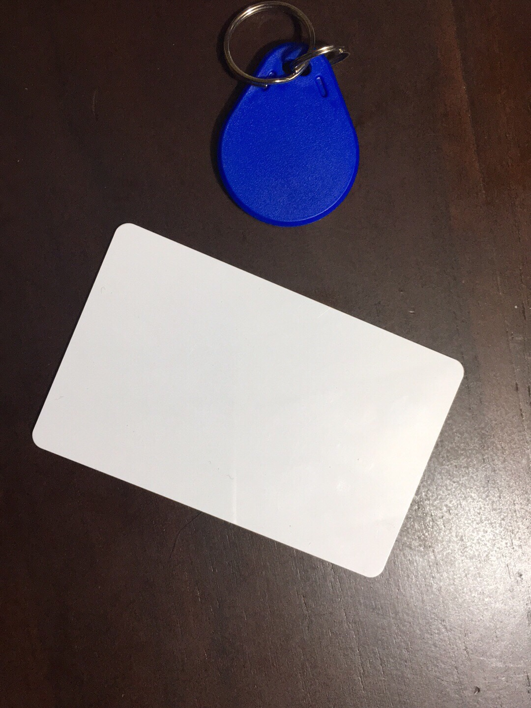

[comment]: # "This is the standard layout for the project, but you can clean this and use your own template"

# Smart Shopping Cart

---

## Team
-  E/14/017, ANOJAN S., [e14017@eng.pdn.ac.lk](mailto:e14017@eng.pdn.ac.lk)
-  E/14/216, MAJURAGEERTHAN A., [e14216@eng.pdn.ac.lk](mailto:e14216@eng.pdn.ac.lk)
-  E/14/311, SANKEERTHAN K., [e14311@eng.pdn.ac.lk](mailto:e14311@eng.pdn.ac.lk)

## Table of Contents
1. [Introduction](#introduction)
2. [Solution Architecture](#solution-architecture )
3. [Hardware & Software Designs](#hardware-and-software-designs)
4. [Links](#links)

---

## Introduction

Trolleys are used in supermarket by customers in the modern world. but they remain in the same state without many improvements.

Our target is to develop a smart trolley which satisfies all needful of customers.  

- [Intro Video](https://youtu.be/WKlyglYFiss)

#### OVERVIEW
As this project is a Unified Project, aspects related to each subjects are as follows.

 

CO321 - Sense bar code from product which are put in cart
Show total bill , discounts , etc in LCD display which is attached in trolley.  

CO324 - When consumer put a product in cart, product's  bar code is sent to server in real time and server replay a description of that product for displaying in LCD.
Offers and other details are also come from server to cart in real time.  

CO325 - There will be many carts in a super market. every cart has it's own unique private key and communication between server and cart is fully encrypted.

## Solution Architecture

#### Outline of the plan
 
- Scan the bar code of product.(customers will do it themself)

- Show price , offer details , total bills , reminders, paths , etc in the LCD display which is attached in the cart.

- All data are saved in branch server.

- If user accept to buy , then it will be added to user’s total bill.

- User can pay bill when leaving (Bill is already calculated in the cart).

## Hardware and Software Designs

#### RFID  Reader instead of Barcode Scanner
  
Intial Project Plan we decided to use bracode to identify product,Now we have planned to replace barcode , continue project using RFID reader and tag attached Products.RFID has lot of issuses such as working in presence of electric field but some cases  it is good to handle some situations, like counting and detecting no things in Shopping cart. It can read product id and product exp date and name.  

  
  

### Documents  
- [Project Proposal](docs/data/documents/1.pdf)  
- [Project Report](docs/data/documents/2.pdf)

## Links

- <a href = "https://github.com/cepdnaclk/e14-3yp-Smart-Shopping-Cart" target = "_blank">Project Repository</a>
- <a href = "https://cepdnaclk.github.io/e14-3yp-Smart-Shopping-Cart/" target = "_blank">Project Page</a>
- <a href = "http://www.ce.pdn.ac.lk/" target = "_blank">Department of Computer Engineering</a>
- <a href = "https://eng.pdn.ac.lk/" target = "_blank">University of Peradeniya</a>

[//]: # (Please refer this to learn more about Markdown syntax)
[//]: # (https://github.com/adam-p/markdown-here/wiki/Markdown-Cheatsheet)
